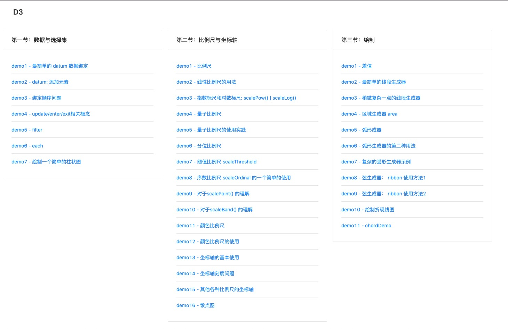
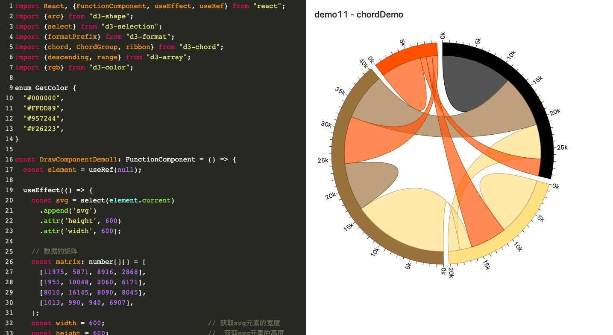
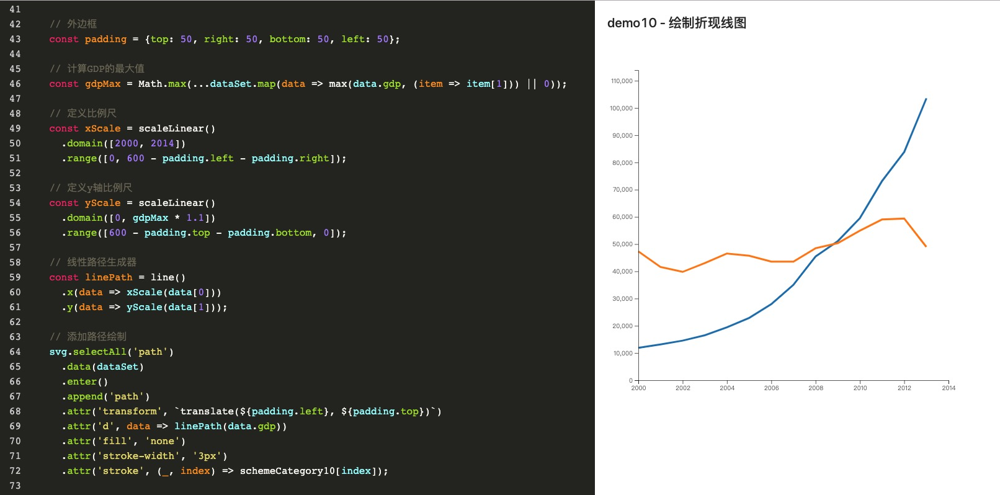

## D3 demo 示例

TypeScript + react hooks + D3 version5 代码示例项目

> 启动
```
yarn install 

yarn dev

访问 http://127.0.0.1:3001/
```
[D3 v5 学习文档传送门](https://github.com/yanlele/D3.js-learning)

### 效果








